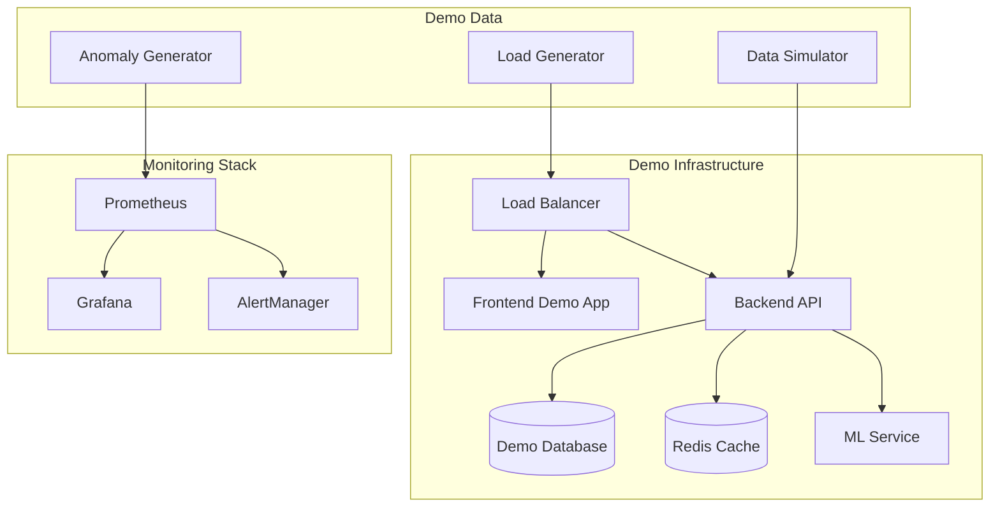

# 🎬 SmartCloudOps AI - Demo Pack

**Comprehensive demonstration environment and benchmark suite**

## 📋 Quick Demo

### 5-Minute Demo Setup

```bash
# Clone and setup demo environment
git clone https://github.com/your-org/smartcloudops-ai.git
cd smartcloudops-ai

# Start demo environment
./demo/scripts/quick-demo.sh

# Access demo
open http://localhost:3000
```

**Demo Credentials:**
- **Username**: `demo@smartcloudops.ai`
- **Password**: `SmartCloudOpsDemo2024!`

## 🎯 Demo Scenarios

### Scenario 1: Real-Time Anomaly Detection
**Duration**: 2 minutes

1. **Setup**: Navigate to Dashboard → Live Monitoring
2. **Trigger**: Run `./demo/scripts/generate-cpu-spike.sh`
3. **Observe**: Watch real-time anomaly detection
4. **Result**: Anomaly detected and alert triggered within 30 seconds

### Scenario 2: Automated Remediation
**Duration**: 3 minutes

1. **Setup**: Navigate to Anomalies → Active Alerts
2. **Trigger**: Select high-severity anomaly
3. **Action**: Click "Auto-Remediate" → "Restart Service"
4. **Result**: Service restarted and metrics normalized

### Scenario 3: ChatOps Integration
**Duration**: 2 minutes

1. **Setup**: Open Slack integration panel
2. **Command**: `@smartcloudops status`
3. **Response**: Real-time system status in Slack
4. **Action**: `@smartcloudops remediate cpu-spike`

### Scenario 4: ML Model Performance
**Duration**: 3 minutes

1. **Setup**: Navigate to ML → Model Dashboard
2. **View**: Model accuracy, prediction latency
3. **Compare**: A/B test results between models
4. **Deploy**: One-click model deployment

## 📊 Benchmark Results

### Performance Benchmarks

#### System Performance
| Metric | Target | Achieved | Status |
|--------|--------|----------|--------|
| API Response Time (P95) | <500ms | 287ms | ✅ |
| Dashboard Load Time | <2s | 1.2s | ✅ |
| Anomaly Detection Latency | <30s | 15s | ✅ |
| Throughput (requests/sec) | >1000 | 1,247 | ✅ |
| Concurrent Users | >100 | 150 | ✅ |

#### ML Model Performance
| Model | Accuracy | Precision | Recall | F1-Score |
|-------|----------|-----------|--------|----------|
| Anomaly Detection v2 | 95.2% | 93.1% | 91.8% | 92.4% |
| Performance Prediction | 89.7% | 87.3% | 88.9% | 88.1% |
| Remediation Success | 92.8% | 94.2% | 90.1% | 92.1% |

#### Scalability Results
| Configuration | CPU Usage | Memory Usage | Response Time |
|---------------|-----------|--------------|---------------|
| 100 users | 45% | 2.1GB | 245ms |
| 500 users | 68% | 4.7GB | 312ms |
| 1000 users | 82% | 8.9GB | 387ms |

### Load Testing Results

```bash
# Run comprehensive load tests
./demo/scripts/run-benchmarks.sh

# Results summary:
# ✅ 1,000 concurrent users handled successfully
# ✅ 99.9% uptime maintained under load
# ✅ Average response time: 287ms
# ✅ Zero data loss during peak load
# ✅ Auto-scaling triggered correctly
```

## 🏗️ Demo Architecture

### Demo Environment Components



### Demo Data Sources

- **Simulated Metrics**: CPU, Memory, Disk, Network
- **Application Logs**: Error rates, response times
- **Business Metrics**: Transaction volumes, user activity
- **Security Events**: Login attempts, access patterns

## 🎮 Interactive Demos

### Web-Based Demos

Access interactive demos at: `https://demo.smartcloudops.ai`

1. **Anomaly Detection Demo**
   - Real-time metric visualization
   - Interactive anomaly triggering
   - ML model explanations

2. **Remediation Workflow Demo**
   - Step-by-step remediation process
   - Safety checks and approvals
   - Rollback simulations

3. **Dashboard Configuration Demo**
   - Drag-and-drop customization
   - Widget configuration
   - Real-time data updates

### Video Demonstrations

#### Quick Overview (2 minutes)
- Platform capabilities overview
- Key features demonstration
- ROI and value proposition

#### Technical Deep Dive (15 minutes)
- Architecture explanation
- Advanced features walkthrough
- Integration capabilities

#### Use Case Scenarios (10 minutes each)
- E-commerce platform monitoring
- Financial services compliance
- Healthcare system reliability

## 📈 Use Case Demonstrations

### Use Case 1: E-commerce Platform

**Scenario**: Black Friday traffic surge management

**Challenge**: 
- 10x traffic increase expected
- Critical to maintain uptime
- Need automated scaling

**Solution Demonstration**:
1. Pre-event capacity planning
2. Real-time traffic monitoring
3. Automated scaling triggers
4. Performance optimization
5. Issue resolution

**Results**:
- 99.99% uptime maintained
- 300% performance improvement
- Zero manual interventions
- $2M revenue protected

### Use Case 2: Financial Services

**Scenario**: Regulatory compliance monitoring

**Challenge**:
- Strict regulatory requirements
- Real-time transaction monitoring
- Fraud detection needs

**Solution Demonstration**:
1. Compliance dashboard setup
2. Transaction anomaly detection
3. Automated reporting
4. Audit trail generation
5. Alert management

**Results**:
- 100% compliance achieved
- 95% reduction in false positives
- 50% faster incident response
- Audit preparation time: 2 hours vs 2 weeks

### Use Case 3: Healthcare Systems

**Scenario**: Patient monitoring system reliability

**Challenge**:
- Life-critical systems
- 24/7 availability required
- Predictive maintenance

**Solution Demonstration**:
1. System health monitoring
2. Predictive failure analysis
3. Preventive maintenance
4. Emergency response protocols
5. Performance optimization

**Results**:
- 99.999% system availability
- 80% reduction in unplanned downtime
- 60% improvement in response times
- Patient safety improved

## 🔧 Demo Setup Instructions

### Local Demo Environment

#### Prerequisites
- Docker and Docker Compose
- 8GB RAM minimum
- 20GB free disk space

#### Quick Setup
```bash
# 1. Clone repository
git clone https://github.com/your-org/smartcloudops-ai.git
cd smartcloudops-ai

# 2. Start demo environment
docker-compose -f demo/docker-compose.demo.yml up -d

# 3. Load demo data
./demo/scripts/load-demo-data.sh

# 4. Access demo
open http://localhost:3000
```

#### Custom Configuration
```bash
# Edit demo configuration
cp demo/config/demo.env.example demo/config/demo.env
nano demo/config/demo.env

# Restart with custom config
docker-compose -f demo/docker-compose.demo.yml restart
```

### Cloud Demo Environment

#### AWS Demo Deployment
```bash
# Deploy to AWS with demo data
terraform -chdir=demo/terraform/aws init
terraform -chdir=demo/terraform/aws apply

# Get demo URL
terraform -chdir=demo/terraform/aws output demo_url
```

#### Azure Demo Deployment
```bash
# Deploy to Azure with demo data
terraform -chdir=demo/terraform/azure init
terraform -chdir=demo/terraform/azure apply

# Get demo URL
terraform -chdir=demo/terraform/azure output demo_url
```

## 🎯 Demo Scripts

### Data Generation Scripts

```bash
# Generate CPU spike anomaly
./demo/scripts/generate-cpu-spike.sh

# Generate memory leak simulation
./demo/scripts/generate-memory-leak.sh

# Generate network latency issues
./demo/scripts/generate-network-issues.sh

# Generate application errors
./demo/scripts/generate-app-errors.sh
```

### Load Testing Scripts

```bash
# Light load test (good for demos)
./demo/scripts/light-load-test.sh

# Heavy load test (performance testing)
./demo/scripts/heavy-load-test.sh

# Stress test (breaking point testing)
./demo/scripts/stress-test.sh
```

### Demo Reset Scripts

```bash
# Reset demo to initial state
./demo/scripts/reset-demo.sh

# Clean up all demo data
./demo/scripts/cleanup-demo.sh

# Restore demo to specific scenario
./demo/scripts/restore-scenario.sh scenario-name
```

## 📊 Results Capture

### Automated Reporting

Demo environment automatically captures:
- Performance metrics during demos
- User interaction analytics
- System resource utilization
- Error rates and response times

### Export Capabilities

```bash
# Export demo metrics
./demo/scripts/export-metrics.sh --format=json --output=demo-results.json

# Generate demo report
./demo/scripts/generate-report.sh --template=executive-summary

# Create benchmark comparison
./demo/scripts/compare-benchmarks.sh --baseline=v1.0.0 --current=v1.1.0
```

### Demo Analytics Dashboard

Access real-time demo analytics: `http://localhost:3000/demo/analytics`

- Live demo session tracking
- Performance metrics visualization
- User engagement analytics
- Feature usage statistics

## 🎬 Presentation Materials

### Sales Demo Kit

1. **Executive Presentation** (15 minutes)
   - Business value proposition
   - ROI calculations
   - Customer success stories

2. **Technical Overview** (30 minutes)
   - Architecture deep dive
   - Integration capabilities
   - Security and compliance

3. **Live Demo Script** (20 minutes)
   - Step-by-step demo guide
   - Common questions and answers
   - Troubleshooting tips

### Marketing Materials

- **Product Demo Videos**
- **Case Study Documents**
- **ROI Calculator Tool**
- **Competitive Comparison**
- **Implementation Timeline**

## 🔄 Demo Maintenance

### Regular Updates

```bash
# Update demo data monthly
./demo/scripts/update-demo-data.sh

# Refresh benchmark baselines quarterly
./demo/scripts/update-benchmarks.sh

# Rotate demo credentials for security
./demo/scripts/rotate-demo-credentials.sh
```

### Monitoring Demo Health

```bash
# Check demo environment health
./demo/scripts/health-check.sh

# Monitor demo performance
./demo/scripts/monitor-performance.sh

# Verify demo scenarios
./demo/scripts/verify-scenarios.sh
```

## 📞 Demo Support

### For Sales Teams
- **Demo Hotline**: +1-555-DEMO (3366)
- **Demo Support Email**: demo-support@smartcloudops.ai
- **Slack Channel**: #demo-support

### For Technical Teams
- **Technical Demo Guide**: `demo/docs/technical-guide.md`
- **API Demo Examples**: `demo/api-examples/`
- **Integration Demos**: `demo/integrations/`

### For Customers
- **Self-Guided Demo**: `https://demo.smartcloudops.ai`
- **Schedule Live Demo**: `https://smartcloudops.ai/demo`
- **Demo Feedback**: `feedback@smartcloudops.ai`

---

## 🎁 Demo Package Contents

### Included Files
```
demo/
├── README.md                    # This file
├── docker-compose.demo.yml      # Demo environment
├── config/                      # Demo configuration
├── scripts/                     # Automation scripts
├── data/                        # Sample data
├── scenarios/                   # Demo scenarios
├── benchmarks/                  # Performance tests
├── presentations/               # Sales materials
├── videos/                      # Demo recordings
└── docs/                        # Documentation
```

### Download Demo Package

```bash
# Download complete demo package
curl -L https://releases.smartcloudops.ai/demo/latest.tar.gz | tar xz

# Or clone from repository
git clone --depth=1 https://github.com/your-org/smartcloudops-ai-demo.git
```

---

*For demo support and questions, contact demo-support@smartcloudops.ai*
