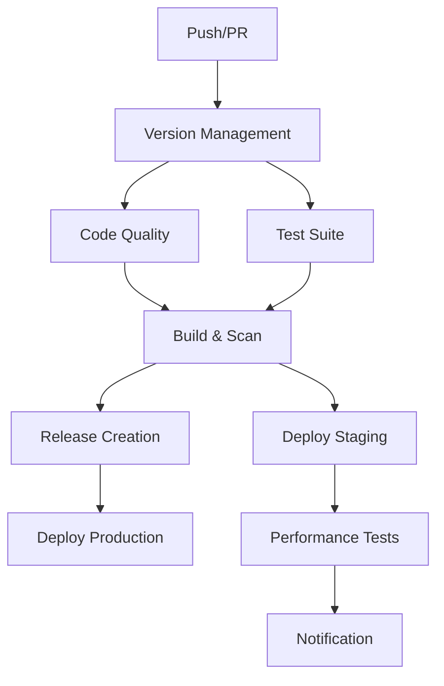

# 🚀 CI/CD Guide - SmartCloudOps AI

Complete guide to our enhanced CI/CD pipeline with build automation, testing, security scanning, and deployment.

## 📋 Overview

Our CI/CD pipeline provides:
- **Automated Quality Gates**: Code formatting, linting, security scanning
- **Parallel Testing**: Unit, integration, API, and smoke tests
- **Multi-Platform Builds**: Docker images for AMD64 and ARM64
- **Security-First**: Vulnerability scanning, signed artifacts, SBOM generation
- **Release Automation**: Semantic versioning, changelog generation, GitHub releases
- **Performance Testing**: Load testing with detailed reports
- **Cache Optimization**: Intelligent caching with automated cleanup

## 🏗️ Pipeline Architecture



## 🛠️ Workflows

### 1. Enhanced Pipeline (`enhanced-pipeline.yml`)

**Triggers:**
- Push to `main`, `develop`, `ci/full-pipeline`
- Pull requests to `main`, `develop`
- Manual dispatch with environment selection

**Stages:**
1. **Version Management** - Semantic versioning and changelog
2. **Code Quality** - Parallel formatting, linting, security checks
3. **Test Suite** - Parallel unit, integration, API, smoke tests
4. **Build & Scan** - Multi-platform Docker builds with security scanning
5. **Release Creation** - Automated GitHub releases with SBOM
6. **Deployment** - Staging and production deployments
7. **Reporting** - Comprehensive pipeline summary

### 2. Release Automation (`release-automation.yml`)

**Features:**
- Manual trigger with release type selection
- Automatic version bumping (major/minor/patch/prerelease)
- Changelog generation from Git history
- Version file updates (Chart.yaml, package.json, etc.)
- Dry run capability

**Usage:**
```bash
# Trigger release workflow
gh workflow run release-automation.yml -f release_type=minor -f dry_run=false
```

### 3. Performance Testing (`performance-testing.yml`)

**Features:**
- Locust-based load testing
- Configurable virtual users and duration
- Performance threshold validation
- Visual charts and reports
- PR comments with results

**Thresholds:**
- Average Response Time: ≤500ms
- 95th Percentile: ≤1000ms
- Failure Rate: ≤1%
- Requests/Second: ≥10 RPS

### 4. Cache Optimization (`cache-optimization.yml`)

**Features:**
- Daily cache analysis and cleanup
- Configurable retention periods
- Cache usage reporting
- Rebuild capabilities

## 🔧 Configuration

### Environment Variables

```yaml
env:
  REGISTRY: ghcr.io
  IMAGE_NAME: ${{ github.repository }}/smartcloudops
  PYTHON_VERSION: "3.11"
  NODE_VERSION: "18"
```

### Required Secrets

| Secret | Description | Example |
|--------|-------------|---------|
| `GITHUB_TOKEN` | Automatic (for registry) | Auto-generated |
| `TEST_OPENAI_API_KEY` | OpenAI API for testing | `sk-...` |
| `TEST_GEMINI_API_KEY` | Gemini API for testing | `AIza...` |
| `TEST_REDIS_PASSWORD` | Redis password for tests | `secure_password` |
| `TEST_SECRET_KEY` | Flask secret key | `random_string` |
| `TEST_JWT_SECRET_KEY` | JWT secret key | `jwt_secret` |

### GitHub Settings

1. **Enable GitHub Packages**:
   - Go to Repository Settings → Actions → General
   - Enable "Read and write permissions"

2. **Branch Protection Rules**:
   ```yaml
   main:
     required_status_checks:
       - Code Quality & Security
       - Test Suite
       - Build & Security Scan
     require_up_to_date_branches: true
     restrictions:
       push_restrictions: []
   ```

## 🏃‍♂️ Running Pipelines

### Automatic Triggers

```bash
# Trigger full pipeline
git push origin main

# Trigger PR pipeline
git push origin feature-branch
gh pr create --title "Feature" --body "Description"
```

### Manual Triggers

```bash
# Enhanced pipeline with custom environment
gh workflow run enhanced-pipeline.yml \
  -f environment=staging \
  -f create_release=true

# Performance testing
gh workflow run performance-testing.yml \
  -f test_duration=120 \
  -f virtual_users=20

# Release automation
gh workflow run release-automation.yml \
  -f release_type=patch \
  -f dry_run=false
```

## 🐳 Container Images

### Image Variants

1. **Development**: `ghcr.io/repo/smartcloudops:tag-development`
   - Includes dev dependencies
   - Debug mode enabled
   - Hot reload support

2. **Production**: `ghcr.io/repo/smartcloudops:tag-production`
   - Optimized multi-stage build
   - Minimal base image
   - Security hardened
   - Health checks included

### Image Tags

```bash
# Latest stable
docker pull ghcr.io/repo/smartcloudops:latest-production

# Specific version
docker pull ghcr.io/repo/smartcloudops:v1.0.0-production

# Branch-based
docker pull ghcr.io/repo/smartcloudops:main-production
```

## 🔒 Security Features

### 1. Image Signing

All images are signed with Cosign:
```bash
# Verify image signature
cosign verify ghcr.io/repo/smartcloudops:tag --certificate-identity=...
```

### 2. SBOM Generation

Software Bill of Materials included with every release:
- Dependency tracking
- Vulnerability analysis
- License compliance

### 3. Security Scanning

Multi-layer security scanning:
- **Bandit**: Python security issues
- **Safety**: Dependency vulnerabilities  
- **Trivy**: Container and filesystem scanning
- **CodeQL**: Static analysis (if enabled)

## 📊 Monitoring & Observability

### Pipeline Metrics

Monitor pipeline performance:
```bash
# Pipeline success rate
gh api repos/:owner/:repo/actions/runs --paginate | jq '.workflow_runs[] | select(.conclusion=="success") | .id' | wc -l

# Average pipeline duration
gh api repos/:owner/:repo/actions/runs --paginate | jq '.workflow_runs[] | .run_started_at + " " + .updated_at'
```

### Performance Tracking

Performance test results stored in:
- `docs/results/performance-*.json`
- GitHub Actions artifacts
- PR comments

## 🛠️ Troubleshooting

### Common Issues

1. **Build Timeouts**:
   ```yaml
   # Increase timeout in workflow
   timeout-minutes: 30
   ```

2. **Cache Issues**:
   ```bash
   # Clear cache manually
   gh workflow run cache-optimization.yml -f cache_action=cleanup
   ```

3. **Test Failures**:
   ```bash
   # Run tests locally
   python -m pytest tests/ -v --tb=short
   ```

4. **Registry Authentication**:
   ```bash
   # Check token permissions
   gh auth status
   ```

### Debug Commands

```bash
# Validate pipeline configuration
./scripts/ci/validate-pipeline.sh

# Check workflow syntax
gh workflow view enhanced-pipeline.yml

# Monitor workflow run
gh run watch <run-id>

# Download artifacts
gh run download <run-id>
```

## 🚀 Deployment

### Staging Deployment

Automatic on `main` branch:
```bash
# Manual trigger
gh workflow run enhanced-pipeline.yml -f environment=staging
```

### Production Deployment

Triggered by version tags:
```bash
# Create release tag
git tag -a v1.0.0 -m "Release v1.0.0"
git push origin v1.0.0
```

### Helm Deployment

```bash
# Deploy with CI-built image
helm upgrade --install smartcloudops-ai ./deploy/helm/smartcloudops-ai \
  --namespace smartcloudops-prod \
  --set backend.image.tag=v1.0.0-production \
  --set frontend.image.tag=v1.0.0-production
```

## 📈 Performance Optimization

### Build Optimization

1. **Multi-stage Dockerfiles**
2. **Layer caching**
3. **Parallel job execution**
4. **Dependency caching**

### Pipeline Speed

Target metrics:
- **Quality Gate**: <5 minutes
- **Test Suite**: <10 minutes
- **Build & Scan**: <15 minutes
- **Total Pipeline**: <20 minutes

## 🔄 Maintenance

### Weekly Tasks

1. Review pipeline performance metrics
2. Update dependency versions
3. Rotate secrets if needed
4. Clean up old artifacts

### Monthly Tasks

1. Review and update workflow configurations
2. Security audit of pipeline
3. Performance baseline updates
4. Documentation updates

## 📚 Resources

- [GitHub Actions Documentation](https://docs.github.com/en/actions)
- [Docker Build Push Action](https://github.com/docker/build-push-action)
- [Helm Chart Testing](https://github.com/helm/chart-testing)
- [Cosign Container Signing](https://github.com/sigstore/cosign)

## 🤝 Contributing

1. Test workflow changes locally with `act` (if possible)
2. Use minimal permission sets
3. Include timeout settings
4. Add comprehensive error handling
5. Document new workflows in this guide

---

**Next**: See [Performance Testing Guide](./PERFORMANCE_TESTING.md) for detailed load testing procedures.
