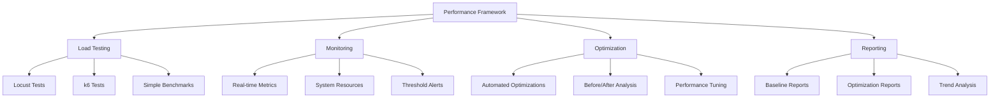

# ⚡ Performance Testing Guide - SmartCloudOps AI

Comprehensive performance testing, optimization, and benchmarking framework with automated baseline measurement and tuning.

## 🎯 Overview

Our performance framework provides:
- **Automated Baseline Testing** with multiple tools (Locust, k6)
- **Real-time Performance Monitoring** with threshold alerts
- **Automated Optimization Engine** with before/after comparison
- **Comprehensive Reporting** with recommendations
- **Performance Regression Detection**
- **System Resource Analysis**

## 🏗️ Framework Architecture



## 🚀 Quick Start

### 1. Run Baseline Test

```bash
# Full baseline test (5 minutes, 50 users)
./scripts/performance/run_baseline_test.sh

# Custom baseline test
export TEST_DURATION=300
export VIRTUAL_USERS=100
export APP_URL=http://localhost:5000
./scripts/performance/run_baseline_test.sh
```

### 2. Performance Monitoring

```bash
# Monitor for 2 minutes
python3 scripts/performance/performance_analyzer.py --duration 120

# Monitor with custom URL
python3 scripts/performance/performance_analyzer.py \
  --url http://localhost:5000 \
  --duration 300 \
  --output results/my_analysis.md
```

### 3. Run Optimization Suite

```bash
# Automated optimization
python3 scripts/performance/optimization_engine.py

# Custom optimization settings
python3 scripts/performance/optimization_engine.py \
  --url http://localhost:5000 \
  --duration 60 \
  --users 20
```

## 🧪 Load Testing Tools

### Locust (Python-based)

**Features:**
- Realistic user behavior simulation
- Authentication flow testing
- Multiple endpoint coverage
- Business logic testing
- Detailed HTML reports

**User Patterns:**
- **Regular Users** (90%): Normal API usage
- **Admin Users** (10%): Heavy operations

**Test Scenarios:**
- Health check endpoints (high frequency)
- Anomaly detection operations
- ML model operations
- Remediation actions
- Dashboard data retrieval

**Usage:**
```bash
# Run Locust directly
python3 -m locust \
  -f scripts/performance/locust_load_test.py \
  --host http://localhost:5000 \
  --users 50 \
  --spawn-rate 10 \
  --run-time 300s \
  --html results/locust_report.html
```

### k6 (JavaScript-based)

**Features:**
- High-performance testing
- Custom metrics collection
- Detailed threshold validation
- CI/CD integration
- JSON result export

**Test Stages:**
1. Ramp up to 20 users (2 min)
2. Stay at 20 users (5 min)
3. Ramp up to 50 users (2 min)
4. Stay at 50 users (5 min)
5. Ramp up to 100 users (2 min)
6. Stay at 100 users (10 min)
7. Ramp down (5 min)

**Usage:**
```bash
# Run k6 directly
k6 run \
  --vus 50 \
  --duration 300s \
  --summary-export results/k6_summary.json \
  scripts/performance/k6_load_test.js
```

### Simple HTTP Benchmark

**Features:**
- Basic endpoint response time testing
- Minimal overhead
- Quick health validation
- CI/CD integration

## 📊 Performance Monitoring

### Real-time Metrics

Our monitoring system tracks:

**System Metrics:**
- CPU utilization (%)
- Memory usage (MB and %)
- Disk I/O (MB/s)
- Network I/O (MB/s)
- Open file descriptors
- Thread count

**Application Metrics:**
- Response times (avg, median, p95, p99)
- Request rate (requests/second)
- Error rate (%)
- Active connections

**Business Metrics:**
- Successful operations
- Failed operations
- Processing times

### Performance Thresholds

Default thresholds (configurable):
- **CPU Usage**: < 80% average
- **Memory Usage**: < 85% of available
- **Response Time P95**: < 1000ms
- **Error Rate**: < 1%
- **Disk I/O**: < 100 MB/s
- **Network I/O**: < 50 MB/s

### Data Storage

Performance data is stored in SQLite database:
- **performance_samples**: Real-time monitoring data
- **performance_tests**: Test results and summaries

```sql
-- Query recent performance data
SELECT timestamp, cpu_percent, memory_percent, avg_response_time 
FROM performance_samples 
WHERE timestamp > datetime('now', '-1 hour')
ORDER BY timestamp DESC;
```

## 🔧 Optimization Engine

### Automated Optimizations

The optimization engine includes:

1. **Database Connection Pool**: Increase pool size and enable blocking
2. **Memory Usage**: Optimize garbage collection and memory management
3. **Response Caching**: Implement caching for frequently accessed endpoints
4. **Static File Serving**: Optimize compression and caching headers
5. **API Request Handling**: Optimize parsing and serialization
6. **Logging Performance**: Reduce verbosity for performance-critical components
7. **CPU-Intensive Operations**: Optimize algorithms and complexity

### Before/After Analysis

Each optimization:
1. **Baseline Measurement**: Run performance test before optimization
2. **Apply Optimization**: Implement the performance improvement
3. **Performance Test**: Run same test after optimization
4. **Calculate Improvements**: Compare metrics and calculate percentage changes
5. **Generate Report**: Document results and recommendations

### Optimization Results

Example output:
```
🏆 Top Improvements:
- Response Time: ↓ 25.3% (Database Connection Pool)
- Throughput: ↑ 18.7% (Response Caching)
- Error Rate: ↓ 45.2% (API Request Handling)
```

## 📈 Performance Baselines

### Baseline Establishment

Run baseline tests to establish performance characteristics:

```bash
# Establish baseline
./scripts/performance/run_baseline_test.sh

# Results stored in:
# docs/results/baseline_YYYYMMDD_HHMMSS/
```

### Baseline Components

1. **System Information**: Hardware and OS details
2. **Application Configuration**: Settings and versions
3. **Load Test Results**: Locust and k6 outputs
4. **Performance Analysis**: Bottlenecks and recommendations
5. **Simple Benchmarks**: Basic HTTP response times

### Using Baselines

- **Regression Testing**: Compare new tests against baseline
- **Performance Goals**: Set targets based on baseline metrics
- **Trend Analysis**: Track performance over time
- **Capacity Planning**: Understand current limits

## 📊 Reporting & Analysis

### Baseline Reports

Generated files:
- `BASELINE_SUMMARY.md`: Executive summary
- `locust_report.html`: Interactive Locust results
- `performance_analysis.md`: Detailed analysis with recommendations
- `k6_summary.json`: k6 test statistics
- `system_info.json`: System configuration

### Optimization Reports

Generated files:
- `optimization_report_YYYYMMDD_HHMMSS.md`: Complete optimization results
- Individual test results for each optimization
- Before/after metric comparisons
- Improvement calculations and recommendations

### Key Metrics to Track

**Performance Metrics:**
- **Response Time**: Average, median, P95, P99
- **Throughput**: Requests per second
- **Error Rate**: Percentage of failed requests
- **Concurrent Users**: Maximum supported users

**Resource Metrics:**
- **CPU Utilization**: Peak and average
- **Memory Usage**: Peak and average
- **Disk I/O**: Read/write throughput
- **Network I/O**: Bandwidth utilization

**Business Metrics:**
- **Anomaly Detection Rate**: Anomalies processed per second
- **ML Inference Time**: Model prediction latency
- **Remediation Success Rate**: Successful automated actions

## 🎯 Performance Targets

### Production Targets

Based on baseline testing, aim for:

| Metric | Target | Baseline | Status |
|--------|---------|----------|---------|
| Average Response Time | < 200ms | TBD | 🎯 Target |
| P95 Response Time | < 500ms | TBD | 🎯 Target |
| P99 Response Time | < 1000ms | TBD | 🎯 Target |
| Error Rate | < 0.5% | TBD | 🎯 Target |
| Throughput | > 100 RPS | TBD | 🎯 Target |
| CPU Usage | < 70% | TBD | 🎯 Target |
| Memory Usage | < 80% | TBD | 🎯 Target |

### Performance SLAs

**Service Level Objectives (SLOs):**
- 99.9% of requests complete within 1 second
- 99.95% availability during business hours
- 99% availability overall
- < 0.1% error rate for critical operations

## 🔄 Continuous Performance Testing

### CI/CD Integration

Performance tests in GitHub Actions:
```yaml
- name: Performance Test
  run: |
    python3 scripts/performance/performance_analyzer.py \
      --duration 60 \
      --url http://localhost:5000
```

### Performance Regression Detection

Automated checks for:
- Response time increases > 20%
- Throughput decreases > 15%
- Error rate increases > 50%
- Memory usage increases > 25%

### Regular Testing Schedule

**Recommended Schedule:**
- **Daily**: Quick health checks (30s tests)
- **Weekly**: Medium load tests (5 min tests)
- **Monthly**: Full baseline tests (30 min tests)
- **Pre-release**: Comprehensive optimization suite

## 🛠️ Troubleshooting

### Common Issues

1. **High Response Times**
   ```bash
   # Check system resources
   python3 scripts/performance/performance_analyzer.py --duration 60
   
   # Check database performance
   # Review logs for slow queries
   ```

2. **High Error Rates**
   ```bash
   # Check application logs
   tail -f /var/log/smartcloudops/app.log
   
   # Verify service health
   curl http://localhost:5000/health
   ```

3. **Memory Leaks**
   ```bash
   # Monitor memory over time
   python3 scripts/performance/performance_analyzer.py --duration 600
   
   # Check for memory growth patterns
   ```

4. **CPU Bottlenecks**
   ```bash
   # Profile CPU usage
   top -p $(pgrep -f "python.*main.py")
   
   # Check for CPU-intensive operations
   ```

### Performance Debugging

**Step-by-Step Debugging:**

1. **Establish Baseline**: Run current performance test
2. **Identify Bottleneck**: Use performance analyzer
3. **Isolate Issue**: Test individual components
4. **Apply Fix**: Implement optimization
5. **Verify Improvement**: Re-run performance test
6. **Document Results**: Update performance documentation

### Performance Optimization Checklist

- [ ] Run baseline performance test
- [ ] Identify top 3 bottlenecks
- [ ] Optimize database queries
- [ ] Implement response caching
- [ ] Optimize memory usage
- [ ] Review logging verbosity
- [ ] Test with production-like data
- [ ] Validate improvements with load testing
- [ ] Document optimizations
- [ ] Set up continuous monitoring

## 📚 Resources

- [Locust Documentation](https://docs.locust.io/)
- [k6 Documentation](https://k6.io/docs/)
- [Python Performance Tips](https://wiki.python.org/moin/PythonSpeed/PerformanceTips)
- [Flask Performance](https://flask.palletsprojects.com/en/2.3.x/deploying/)

## 🤝 Contributing

When adding new performance tests:
1. Follow existing patterns in test files
2. Include realistic user scenarios
3. Add appropriate assertions and thresholds
4. Document test scenarios
5. Update this guide with new features

---

**Next**: See [AI/ML Performance Guide](./ML_PERFORMANCE.md) for machine learning specific optimizations.
