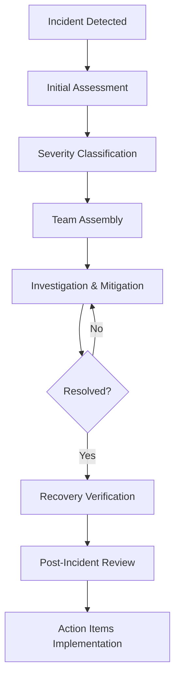

# SmartCloudOps AI - Incident Response Procedures
# Phase 3 Week 7: Production Runbook - Incident Management

## Table of Contents
1. [Incident Response Framework](#incident-response-framework)
2. [Incident Classification](#incident-classification)
3. [Response Procedures](#response-procedures)
4. [Communication Plans](#communication-plans)
5. [Recovery Procedures](#recovery-procedures)
6. [Post-Incident Analysis](#post-incident-analysis)
7. [Business Continuity](#business-continuity)

## Incident Response Framework

### 1. Incident Response Team (IRT) 👥

#### Core Team Members
- **Incident Commander**: Overall incident coordination and decision-making
- **Technical Lead**: Technical investigation and resolution
- **Communications Lead**: Stakeholder communication and updates
- **Security Lead**: Security-related incidents and forensics
- **Customer Success**: Customer impact assessment and communication

#### On-Call Rotation
```bash
# Current on-call engineer
curl -s "https://api.pagerduty.com/oncalls" -H "Authorization: Token ${PAGERDUTY_API_KEY}" | jq '.oncalls[0].user.name'

# Escalation chain
1. Primary On-Call Engineer (0-15 minutes)
2. Secondary On-Call Engineer (15-30 minutes)
3. Engineering Manager (30-45 minutes)
4. CTO (45+ minutes for P0 incidents)
```

### 2. Incident Lifecycle



## Incident Classification

### Severity Levels 🚨

#### P0 - Critical (Response: 15 minutes)
- **Definition**: Complete service outage or severe security breach
- **Examples**: 
  - Total platform unavailability
  - Data breach or unauthorized access
  - Complete database failure
  - Critical security vulnerability exploitation
- **Response Team**: Full IRT + Executive Team
- **Communication**: Immediate customer notification

#### P1 - High (Response: 1 hour)
- **Definition**: Major functionality impaired, significant user impact
- **Examples**:
  - Core features unavailable (API down, login failures)
  - Performance degradation affecting >50% users
  - Data corruption affecting multiple customers
- **Response Team**: Core IRT
- **Communication**: Customer notification within 2 hours

#### P2 - Medium (Response: 4 hours)
- **Definition**: Minor functionality affected, limited user impact
- **Examples**:
  - Non-critical feature outages
  - Performance issues affecting <25% users
  - Minor data inconsistencies
- **Response Team**: Technical Lead + On-Call Engineer
- **Communication**: Internal stakeholders only

#### P3 - Low (Response: Next business day)
- **Definition**: Cosmetic issues, minimal user impact
- **Examples**:
  - UI/UX issues
  - Documentation errors
  - Non-critical monitoring alerts
- **Response Team**: Development team during business hours
- **Communication**: Internal tracking only

### Impact Assessment Matrix

| Affected Users | Service Impact | Severity | Response Time |
|----------------|----------------|----------|---------------|
| >75% | Complete outage | P0 | 15 min |
| 25-75% | Major degradation | P1 | 1 hour |
| 5-25% | Minor impact | P2 | 4 hours |
| <5% | Minimal impact | P3 | Next day |

## Response Procedures

### 1. Initial Response Checklist ✅

#### Immediate Actions (0-15 minutes)
- [ ] Acknowledge the incident
- [ ] Assess initial severity and impact
- [ ] Open incident communication channel
- [ ] Page appropriate team members
- [ ] Begin investigation and logging
- [ ] Implement immediate mitigation if obvious

#### Assessment Phase (15-30 minutes)
- [ ] Confirm incident severity
- [ ] Assemble appropriate response team
- [ ] Establish incident command structure
- [ ] Create incident tracking ticket
- [ ] Begin stakeholder communication
- [ ] Implement war room if P0/P1

### 2. Investigation Procedures

#### Technical Investigation Workflow
```bash
#!/bin/bash
# Incident investigation script

INCIDENT_ID="INC-$(date +%Y%m%d-%H%M)"
TIMESTAMP=$(date -u +"%Y-%m-%d %H:%M:%S UTC")

echo "=== INCIDENT INVESTIGATION: $INCIDENT_ID ==="
echo "Timestamp: $TIMESTAMP"
echo

# 1. System Health Check
echo "1. SYSTEM HEALTH STATUS"
kubectl get nodes
kubectl get pods --all-namespaces | grep -v Running
echo

# 2. Recent Changes
echo "2. RECENT DEPLOYMENTS"
kubectl rollout history deployment/smartcloudops-api -n smartcloudops | tail -5
kubectl rollout history deployment/smartcloudops-worker -n smartcloudops | tail -5
echo

# 3. Resource Usage
echo "3. RESOURCE UTILIZATION"
kubectl top nodes
kubectl top pods -n smartcloudops --sort-by=cpu
echo

# 4. Recent Events
echo "4. RECENT KUBERNETES EVENTS"
kubectl get events --sort-by=.metadata.creationTimestamp -n smartcloudops | tail -20
echo

# 5. Application Logs
echo "5. APPLICATION ERROR LOGS"
kubectl logs deployment/smartcloudops-api -n smartcloudops --tail=50 | grep -i error
echo

# 6. Database Status
echo "6. DATABASE CONNECTION STATUS"
kubectl exec -it deployment/smartcloudops-api -n smartcloudops -- python -c "
try:
    from app.database import get_db
    db = next(get_db())
    print('✅ Database connection: OK')
except Exception as e:
    print(f'❌ Database error: {e}')
"
echo

# 7. External Dependencies
echo "7. EXTERNAL SERVICES STATUS"
curl -s -o /dev/null -w "Redis: %{http_code}\n" http://smartcloudops-redis:6379/ping || echo "❌ Redis unavailable"
echo

# 8. Monitoring Alerts
echo "8. ACTIVE ALERTS"
curl -s "http://prometheus:9090/api/v1/alerts" | jq '.data.alerts[] | select(.state == "firing") | .labels.alertname'
```

#### Root Cause Analysis Framework
1. **Timeline Construction**: Document when the incident started and key events
2. **Change Analysis**: Review recent deployments, configuration changes, infrastructure modifications
3. **Dependency Mapping**: Check external service dependencies and their status
4. **Data Analysis**: Examine logs, metrics, and traces for patterns
5. **Hypothesis Testing**: Form and test theories about the root cause

### 3. Mitigation Strategies

#### Immediate Mitigation Options
```bash
# 1. Service Restart
kubectl rollout restart deployment/smartcloudops-api -n smartcloudops

# 2. Scale Up Resources
kubectl scale deployment smartcloudops-api --replicas=10 -n smartcloudops

# 3. Traffic Routing (Emergency Maintenance Page)
kubectl patch ingress smartcloudops-ingress -n smartcloudops -p '
spec:
  rules:
  - host: api.smartcloudops.ai
    http:
      paths:
      - path: /
        pathType: Prefix
        backend:
          service:
            name: maintenance-page
            port:
              number: 80
'

# 4. Database Failover
aws rds failover-db-cluster --db-cluster-identifier smartcloudops-prod-cluster

# 5. Rollback Deployment
kubectl rollout undo deployment/smartcloudops-api -n smartcloudops
kubectl rollout undo deployment/smartcloudops-worker -n smartcloudops

# 6. Circuit Breaker Activation
kubectl patch configmap smartcloudops-config -n smartcloudops -p '
data:
  CIRCUIT_BREAKER_ENABLED: "true"
  CIRCUIT_BREAKER_THRESHOLD: "5"
'
```

## Communication Plans

### 1. Internal Communication

#### Incident Communication Channel Setup
```bash
# Create incident-specific Slack channel
curl -X POST https://slack.com/api/conversations.create \
  -H "Authorization: Bearer ${SLACK_BOT_TOKEN}" \
  -H "Content-Type: application/json" \
  -d "{
    \"name\": \"incident-${INCIDENT_ID}\",
    \"purpose\": \"Incident response for ${INCIDENT_ID}\",
    \"is_private\": false
  }"

# Invite key personnel
curl -X POST https://slack.com/api/conversations.invite \
  -H "Authorization: Bearer ${SLACK_BOT_TOKEN}" \
  -H "Content-Type: application/json" \
  -d "{
    \"channel\": \"incident-${INCIDENT_ID}\",
    \"users\": \"${INCIDENT_TEAM_MEMBERS}\"
  }"
```

#### Status Update Template
```markdown
## 🚨 Incident Update - ${INCIDENT_ID}

**Status**: [Investigating/Mitigating/Resolved]
**Severity**: P[0-3]
**Start Time**: ${START_TIME}
**Duration**: ${DURATION}

### Current Situation
- Brief description of the issue
- Current impact on users/services
- Mitigation steps taken

### Next Steps
- Immediate actions being taken
- Expected resolution time
- Next update scheduled for

### Contact
- Incident Commander: @username
- Technical Lead: @username
- Next update: +30 minutes

---
*Incident tracking: ${INCIDENT_TRACKING_URL}*
```

### 2. External Communication

#### Customer Communication Templates

**Initial Notification (P0/P1 incidents)**
```
Subject: [Action Required] Service Disruption - SmartCloudOps AI

Dear SmartCloudOps AI Customer,

We are currently experiencing technical difficulties that may impact your access to our platform. Our engineering team is actively working to resolve this issue.

**Impact**: [Description of user-facing impact]
**Start Time**: [Time in customer's timezone]
**Current Status**: Investigating

We will provide updates every 30 minutes until resolved.

For real-time updates, please check our status page: https://status.smartcloudops.ai

We apologize for any inconvenience and appreciate your patience.

Best regards,
SmartCloudOps AI Team
```

**Resolution Notification**
```
Subject: [Resolved] Service Disruption - SmartCloudOps AI

Dear SmartCloudOps AI Customer,

The service disruption affecting SmartCloudOps AI has been resolved.

**Issue**: [Brief description]
**Duration**: [Total downtime]
**Resolution**: [What was done to fix it]
**Root Cause**: [Brief explanation]

All services are now operating normally. If you continue to experience issues, please contact our support team.

**Post-Incident Actions**:
- We will conduct a thorough post-incident review
- Preventive measures will be implemented
- Detailed report will be available within 72 hours

Thank you for your patience during this incident.

Best regards,
SmartCloudOps AI Team
```

## Recovery Procedures

### 1. Service Recovery Verification

#### Health Check Script
```bash
#!/bin/bash
# Comprehensive service recovery verification

echo "=== SERVICE RECOVERY VERIFICATION ==="
echo "Timestamp: $(date -u)"
echo

# 1. Application Health
echo "1. APPLICATION HEALTH CHECKS"
for endpoint in "/api/health" "/api/status" "/api/metrics"; do
  response=$(curl -s -o /dev/null -w "%{http_code}" "https://api.smartcloudops.ai${endpoint}")
  if [ "$response" -eq 200 ]; then
    echo "✅ $endpoint: OK ($response)"
  else
    echo "❌ $endpoint: FAILED ($response)"
  fi
done
echo

# 2. Database Connectivity
echo "2. DATABASE CONNECTIVITY"
kubectl exec -it deployment/smartcloudops-api -n smartcloudops -- python -c "
from app.database import get_db
from sqlalchemy import text
try:
    with get_db() as db:
        result = db.execute(text('SELECT COUNT(*) FROM users'))
        count = result.fetchone()[0]
    print(f'✅ Database query successful: {count} users')
except Exception as e:
    print(f'❌ Database error: {e}')
"
echo

# 3. Cache System
echo "3. CACHE SYSTEM STATUS"
kubectl exec -it deployment/smartcloudops-api -n smartcloudops -- python -c "
import redis
try:
    r = redis.Redis(host='smartcloudops-redis', port=6379, decode_responses=True)
    r.ping()
    info = r.info()
    print(f'✅ Redis connection: OK')
    print(f'   Memory usage: {info[\"used_memory_human\"]}')
    print(f'   Connected clients: {info[\"connected_clients\"]}')
except Exception as e:
    print(f'❌ Redis error: {e}')
"
echo

# 4. Monitoring Systems
echo "4. MONITORING SYSTEMS"
prometheus_status=$(curl -s -o /dev/null -w "%{http_code}" "http://prometheus:9090/-/healthy")
grafana_status=$(curl -s -o /dev/null -w "%{http_code}" "http://grafana:3000/api/health")

echo "Prometheus: $([ "$prometheus_status" -eq 200 ] && echo '✅ OK' || echo '❌ FAILED')"
echo "Grafana: $([ "$grafana_status" -eq 200 ] && echo '✅ OK' || echo '❌ FAILED')"
echo

# 5. Load Testing
echo "5. BASIC LOAD TEST"
kubectl run load-test --image=loadimpact/k6 --rm -it --restart=Never -- \
  run --vus 5 --duration 30s - <<EOF
import http from 'k6/http';
import { check } from 'k6';

export default function() {
  let response = http.get('https://api.smartcloudops.ai/api/health');
  check(response, {
    'status is 200': (r) => r.status === 200,
    'response time < 500ms': (r) => r.timings.duration < 500,
  });
}
EOF

echo
echo "=== RECOVERY VERIFICATION COMPLETE ==="
```

### 2. Data Integrity Verification

```bash
# Data consistency checks
kubectl exec -it deployment/smartcloudops-api -n smartcloudops -- python -c "
from app.database import get_db
from sqlalchemy import text

checks = [
    ('Users table integrity', 'SELECT COUNT(*) FROM users WHERE email IS NOT NULL'),
    ('Experiments data', 'SELECT COUNT(*) FROM experiments WHERE created_at IS NOT NULL'),
    ('Model registry', 'SELECT COUNT(*) FROM models WHERE status = \"active\"'),
    ('Recent activity', 'SELECT COUNT(*) FROM user_activity WHERE timestamp > NOW() - INTERVAL \"1 hour\"')
]

print('DATA INTEGRITY VERIFICATION')
print('=' * 40)
with get_db() as db:
    for check_name, query in checks:
        try:
            result = db.execute(text(query))
            count = result.fetchone()[0]
            print(f'✅ {check_name}: {count} records')
        except Exception as e:
            print(f'❌ {check_name}: ERROR - {e}')
"
```

## Post-Incident Analysis

### 1. Post-Incident Review Process

#### Timeline Requirements
- **24 hours**: Initial incident summary
- **72 hours**: Detailed root cause analysis
- **1 week**: Action items implementation plan
- **2 weeks**: Follow-up on implemented fixes

#### Post-Incident Review Template
```markdown
# Post-Incident Review: ${INCIDENT_ID}

## Executive Summary
- **Incident**: Brief description
- **Duration**: Total downtime/degradation time
- **Impact**: Number of affected users, business impact
- **Root Cause**: Primary cause of the incident
- **Resolution**: How the incident was resolved

## Timeline of Events
| Time (UTC) | Event | Action Taken | Team Member |
|------------|-------|--------------|-------------|
| 14:23 | Alert fired | Investigation started | @oncall |
| 14:25 | Issue confirmed | Incident declared | @commander |
| 14:30 | Mitigation applied | Service restarted | @tech-lead |
| 14:45 | Service restored | Monitoring resumed | @team |

## Root Cause Analysis

### What Happened
Detailed explanation of the sequence of events that led to the incident.

### Why It Happened
- Immediate cause: What directly triggered the incident
- Contributing factors: Conditions that made the incident possible
- Root cause: Underlying reason why the incident occurred

### Detection and Response
- How was the incident detected?
- Was alerting effective?
- Response time analysis
- Communication effectiveness

## Impact Assessment

### User Impact
- Number of affected users: X,XXX
- Duration of impact: X hours Y minutes
- Functionality affected: List of impacted features
- Customer complaints received: X tickets

### Business Impact
- Revenue impact: $X estimated
- SLA violations: X% availability vs 99.9% target
- Customer churn risk: X accounts at risk
- Regulatory implications: None/Compliance review needed

## What Went Well
- Effective incident response procedures
- Quick team assembly and communication
- Successful mitigation strategies
- Minimal data loss/corruption

## What Could Be Improved
- Faster detection through improved monitoring
- Better automated rollback procedures
- Enhanced communication templates
- More comprehensive testing

## Action Items
| Action Item | Owner | Target Date | Priority | Status |
|-------------|--------|-------------|----------|---------|
| Implement additional monitoring | @sre | YYYY-MM-DD | High | Open |
| Update runbook procedures | @devops | YYYY-MM-DD | Medium | Open |
| Improve alerting thresholds | @platform | YYYY-MM-DD | High | Open |

## Lessons Learned
Key takeaways that will improve our incident response and prevention capabilities.

## Follow-up Actions
- Schedule action item reviews
- Update incident response procedures
- Share learnings with broader team
- Update monitoring and alerting
```

### 2. Metrics and KPIs

#### Incident Response Metrics
```bash
# Generate incident metrics report
python scripts/incident_metrics.py --month $(date +%Y-%m) --output incident-report.json

# Key metrics tracked:
# - Mean Time to Detection (MTTD)
# - Mean Time to Resolution (MTTR)
# - Mean Time Between Failures (MTBF)
# - Incident frequency by severity
# - Root cause categories
# - Customer impact metrics
```

## Business Continuity

### 1. Disaster Recovery Plans

#### RTO/RPO Objectives
- **Recovery Time Objective (RTO)**: 4 hours maximum
- **Recovery Point Objective (RPO)**: 1 hour maximum data loss
- **Availability Target**: 99.9% uptime (8.77 hours downtime/year)

#### DR Activation Criteria
- Complete AWS region failure
- Sustained infrastructure outage >2 hours
- Catastrophic data center event
- Major security breach requiring isolation

#### DR Activation Procedure
```bash
#!/bin/bash
# Disaster Recovery Activation Script

echo "🚨 DISASTER RECOVERY ACTIVATION"
echo "Timestamp: $(date -u)"

# 1. Notify stakeholders
curl -X POST https://hooks.slack.com/disaster-recovery \
  -H 'Content-Type: application/json' \
  -d '{"text": "🚨 DISASTER RECOVERY ACTIVATED - Switching to DR site"}'

# 2. Activate DR environment
terraform workspace select disaster-recovery
terraform apply -var-file=dr.tfvars -auto-approve

# 3. Restore from latest backup
aws rds restore-db-instance-from-db-snapshot \
  --db-instance-identifier smartcloudops-dr \
  --db-snapshot-identifier smartcloudops-latest-snapshot

# 4. Update DNS to point to DR
aws route53 change-resource-record-sets \
  --hosted-zone-id Z123456789 \
  --change-batch file://dr-dns-change.json

# 5. Verify DR environment
./scripts/dr_verification.sh

echo "✅ DR ACTIVATION COMPLETE"
```

### 2. Communication During Major Incidents

#### Executive Escalation (P0 incidents)
- **Immediate**: Notify CTO/CEO within 15 minutes
- **Updates**: Every 15 minutes until resolution
- **Format**: Voice call + written summary
- **Decision Authority**: CTO for technical decisions, CEO for business decisions

#### Customer Communication Strategy
- **Status Page**: Real-time updates on https://status.smartcloudops.ai
- **Email Notifications**: Automatic for service subscribers
- **Social Media**: @SmartCloudOpsAI Twitter updates for major incidents
- **Direct Outreach**: Account managers contact enterprise customers

#### Media Relations (If Required)
- **Press Contact**: press@smartcloudops.ai
- **Spokesperson**: CTO or designated executive
- **Prepared Statements**: Templates for different incident types
- **Legal Review**: All external communications reviewed by legal team

---

**Document Version**: 2.0.0  
**Last Updated**: $(date +%Y-%m-%d)  
**Next Review**: $(date -d '+6 months' +%Y-%m-%d)  
**Document Owner**: Platform Engineering Team
